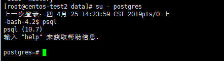
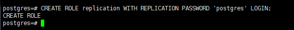
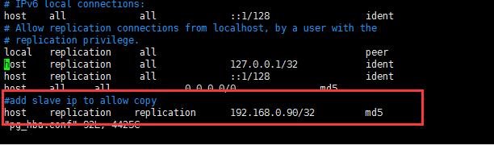
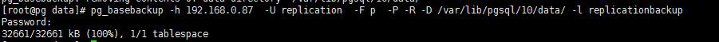
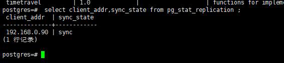

# PostgreSql主从搭建同（异）步流复制

| 服务器IP     | 数据库信息                                          | 备注 |
| ------------ | --------------------------------------------------- | ---- |
| 192.168.0.87 | 数据库版本postgresql10.7(登录用户/密码均为postgres) | 主库 |
| 192.168.0.90 | 数据库版本postgresql10.7(登录用户/密码均为postgres) | 从库 |


## 准备工作

分别在两个服务器上安装PostgreSql服务，并开启远程登录，检查是否配置成功。

**检查完毕后至少把从库关闭掉，以备等下进行配置。**  
（此时默认你已知道了如何进入PostgreSql数据库内，简称pg。）



-----

## 配置主库

#### 创建用户

进入主库，创建一个用于登录主库进行复制的角色replication，密码为postgres。  

`CREATE ROLE replication WITH REPLICATION PASSWORD 'postgres' LOGIN`  



检查用户是否创建成功

进入数据库执行`\du`命令查看数据库角色，发现有了**replication**用户，属性为**复制**。  

#### 配置用户权限

默认数据库初始化后的配置文件地址为`/var/lib/pgsql/10/data`。  

- pg_hba.conf 文件，控制pg访问权限的配置文件。
- postgresql.conf文件，pg自身的配置文件。

配置访问权限文件`pg_hba.conf`允许从库使用replication用户登录进行复制操作。

`vim pg_hba.conf`



#### 配置pg异步流复制

在pg的配置文件postgresql.conf中添加如下内容：  

`wal_level = replica ` 设置wal的等级（WAL）  

`max_wal_senders = 10`  直接按照有多少个从就设置多少亦可  

**顺带一提**

*配置文件中的`Archiving`中的配置项，是对WAL的归档配置，可以用做数据库备份。*

重启主库，使配置生效。


-----

## 基础同步

基础同步是让从库的初始数据与主库保持一致。

实际上就是把主库`/data/*`下的数据文件拷贝到从库`/data/*`下。  

我们采用pg的`pg_basebackup`命令。

- 进入主库开启备份

  执行`SELECT pg_start_backup(‘base’,true)`开启备份。

- 进入从库服务器，把从库的数据文件夹目录(`/var/lib/pgsql/10/data/*`)清空。

​     `rm -rf /var/lib/pgsql/10/data/* `

- 在从库上运行基础备份命令

  `pg_basebackup -h 192.168.0.87  -U replication  -F p  -P -R -D /var/lib/pgsql/10/data/ -l replicationbackup `  

​       输入replication用户的密码，完成基础同步(拷贝)。



- 重新对目录授权

  <font color ="red">重新对该目录(/var/lib/pgsql/10/data/)进行授权，将目录权限给postgres用户，不然无法重启。</font>

  `chown -R postgres.postgres  **/var/lib/pgsql/10/data/ ` 

  检查是否授权成功 `ls -l`。  

- 关闭主库备份

  登录主库服务器，进入主库数据库执行

  `SELECT pg_stop_backup(); `关闭备份。

  

-----

## 配置从库

#### 配置从库postgresql.conf文件

开启`hot_standby=on`即可。

#### 配置`recovery.conf`文件

在从库的数据库目录下（/var/lib/pgsql/10/data/）创建recovery.conf文件。

`vim recovery.conf`

写入如下信息

```
standby_mode = 'on' //表明是从库
primary_conninfo = 'user=replication password=postgres host=192.168.0.87 port=5432 application_name=pgslave01' //连接到主库的信息  application_name 声明从库的名称。
# trigger_file = '/home/tgfile' 目前可注释掉的内容，这个是主从切换的触发文件配置。
# recovery_target_timeline = 'lastest' 目前可注释掉的内容，这是指明恢复的时间线。
```

启动从库，使配置生效。

**登录主库检查**

`select client_addr,sync_state from pg_stat_replication ;`

发现异步复制流已经搭建完成:rocket:。


## 切换到同步流复制

#### 配置主库

在主库的postgresql.conf配置文件中。

设置`synchronous_commit = on`

设置`synchronous_standby_names = 'pgslave01'`或者改为`*`允许所有，看配置文件注释。

重启主库加载配置。

`systemctl restart postgresql.service`

**登录主库检查**

`select client_addr,sync_state from pg_stat_replication ;`

发现已经是同步流复制了:dog:！



-----

参考

[主要参考](<https://www.cnblogs.com/aegis1019/p/8870251.html>)

[其他参考1](<https://blog.csdn.net/germany15914326114/article/details/81196778>)

[其他参考2](<https://www.jianshu.com/p/32ac404e5d87>)


