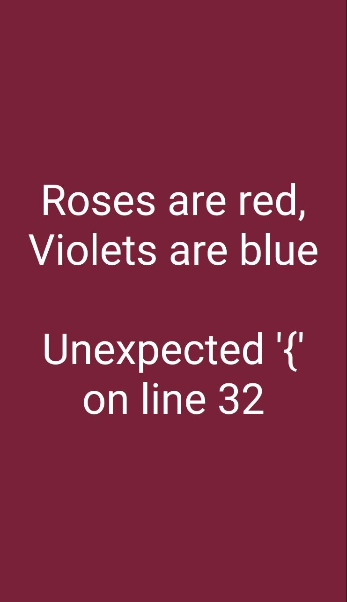

# 国庆宅记

> 渐渐地，都会知道重要的是什么，只是都不会知道还会不会有机会。:rose:


```python
如果时间愿意回来作补偿

夜晚一定总是繁星闪亮


蜘蛛把它困在幽静的小道上

谷场却用余温把它焗得金黄

这我只想把它困在你的身旁


夜色，秋凉

呐

你在欣赏

你在被欣赏
```

---


## 逢

和身边这群一起长大的人待在一起真的是太惬意的事情了。:guitar:

> 有些人一年只能见这几次，有的人可能只能够见这几年了。

---

## 书

- 摸出来课本`《计算机网络》`，翻了一下画了`*`的章节，现在再看和上课摸鱼的感觉果然有些变化。:dog:
- 把`《算法图解》`又过了一遍，不得不说，这本书真的是，真的是，简笔画真的是画的不错。:cat:

---

## 剧

好久没有把时间放在刷剧上了，感觉刷的各种软件开发教程视频倒是与日俱增。

国庆刷了**`《KILL EVE》`**，在`B`站上当然是删减版，这倒刚刚好，那些画面我也不敢看。:rofl:

> 以后想看哪个片子，要是会有点恐怖的，可以去找找删减版，这样好像也不错阿。

---

## 离

> 剪掉了头发，应该是剪掉了烦恼吧。

真的，应该离开了，趁年轻，不要怕。





