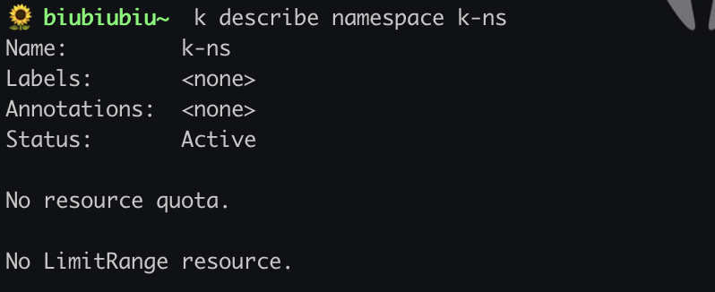
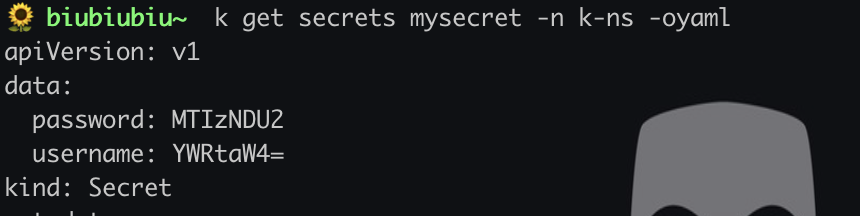
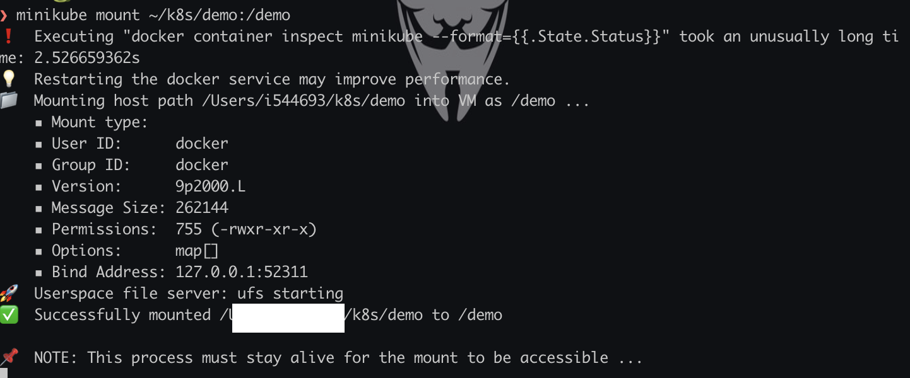
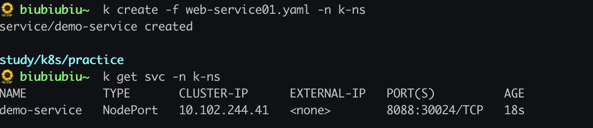
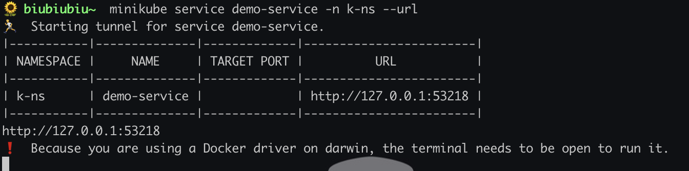

# Minikube实战

要学习K8s，在本地搭建K8s环境，显然[Minikube](https://minikube.sigs.k8s.io/docs/)是一个很好的选择。:rocket:

安装搭建，话不多说。

```shell
brew install minikube
```


## 概要

这次主要是使用Minikube部署一个简单的web项目并暴露服务。

## 构建镜像

本地简单写一个Dockerfile，Jar包自己打一个。

```dockerfile
       │ File: Dockerfile-v0.11
───────┼────────────────────────────────────────────────
   1   │ FROM openjdk:11.0.11-jdk
   2   │ workdir /home
   3   │ COPY demo-0.0.1.jar app.jar
   4   │ EXPOSE 8080
   5   │ ENTRYPOINT ["java","-jar","app.jar"]
```

构建镜像。

```shell
docker build -f Dockerfile -t demo-web:0.1  .
```

> 注意此时的镜像在本地的Docker中二不在Minikube VM内，所以需要给它送进去。

镜像同步到Minikube，这里使用的是`cache`。

```she
minikube cache add demo-web:0.1
```

还可以使用其他方式，参考这里[Pushing images](https://minikube.sigs.k8s.io/docs/handbook/pushing/)。


## 部署

### 创建Namespace

> 不在默认的Default内创建，整一个简单的namespace。

```yam
apiVersion: v1
kind: Namespace
metadata:
  name: k-ns
```

也可以直接

```
k create namespace k-ns
```

 


### 创建Secrets

基本简单挂载一个敏感信息文件。

> 要求是Base64的value，如果有兴趣，你可以通过 `echo YWRtaW4= | base64 -d` 解码看看是什么。:dog:

```shell
apiVersion: v1
kind: Secret
metadata:
  name: mysecret
type: Opaque
data:
  username: YWRtaW4=
  password: MTIzNDU2
```


```she
k create -f web-secret.yaml -n k-ns
```



### 挂载本地目录到Minikube

```
minikube mount <source directory>:<target directory>
```

所以这里我是。

```
minikube mount ~/k8s/demo:/demo
```

更多详情[Mounting filesystems](https://minikube.sigs.k8s.io/docs/handbook/mount/)




### 创建Deployment

> 简单创建一个Deployment名为v-deployment，并且挂载了volume。

注意，这里挂在volume的时候，需要先把本地目录挂在进去。

所以这里的`hostPath`实际上是MinikubeVM内部的目录而不是你自己本地的，所以要先挂在目录到VM。


```yaml
apiVersion: apps/v1
kind: Deployment
metadata:
  name: v-deployment
  labels:
    app: v-springboot-deploy
    user: koy
spec:
  replicas: 3
  selector:
   matchLabels:
     app: v-springbootweb
  template:
    metadata:
      labels:
        app: v-springbootweb
    spec:
      containers:
      - name: v-web
        image: demo-web:0.1
        ports:
        - containerPort: 8080
        volumeMounts:
        - name: demo-v
          mountPath: /data
          
        - name: my-secrets
          mountPath: "/etc/secrets"
          readOnly: true

      volumes:
       - name: demo-v
         hostPath:
          path: /demo
       - name: my-secrets
          secret:
            secretName: mysecret
```


```shell
k create -f web-deployment.yaml -n k-ns
```


###  创建Service

```yaml
apiVersion: v1
kind: Service
metadata:
  name: demo-service
  labels:
    app: demo-service
spec:
    type: NodePort
    selector:
      app: v-springbootweb
    ports:
     - protocol: TCP
       port: 8080
       targetPort: 8080
       nodePort: 30012
```

```she
k create -f web-service.yaml -n k-ns
```



这时候是创建了Service但是端口实际上没有暴露到自己本地，即`nodePort`实际上是MinikubeVM暴露出来的。

真正暴露服务还需要另起shell执行这个，`--url`参数会把暴露访问地址打印在控制台。

```shell
minikube service demo-service --url
```



详情参考[service](https://minikube.sigs.k8s.io/docs/commands/service/)。


:cat: 这一小波结束，打完收工。​

