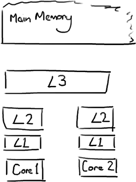
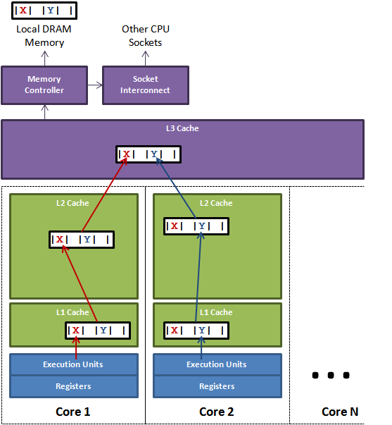

# CPU缓存与缓存行

## 操作系统中的多级缓存

操作系统中， 对于缓存的使用，其实是分层的，如下图。

L1、L2、L3分别表示一级缓存、二级缓存、三级缓存，越靠近CPU的缓存，速度越快，容量也越小。所以L1缓存很小但很快，并且紧靠着在使用它的CPU内核；L2大一些，也慢一些，并且仍然只能被一个单独的CPU核使用；L3更大、更慢，并且被单个插槽上的所有CPU核共享；最后是主存，由全部插槽上的所有CPU核共享。



当CPU执行运算的时候，它先去L1查找所需的数据、再去L2、然后是L3，如果最后这些缓存中都没有，所需的数据就要去主内存拿。走得越远，运算耗费的时间就越长。所以如果你在做一些很频繁的事，你要尽量确保数据在L1缓存中。CPU读取主存中的数据会比从前面几级缓存中读取慢上几个数量级。


## 缓存行


Cache是由很多个cache line组成的。每个cache line通常是64字节（这个值具体和处理器架构有关），并且它有效地引用主内存中的一块地址。例如，一个Java的long类型变量是8字节，因此在一个缓存行中可以存8个long类型的变量。

CPU每次从主存中拉取数据时，会把相邻的数据也存入同一个cache line，比如访问一个long数组的时候从主存中拉取a1的值，也会把临近的a2...a7也拉上。因此你能非常快的遍历这个数组。事实上，你可以非常快速的遍历在连续内存块中分配的任意数据结构。如果数据结构中的项在内存中不是彼此相邻的（比如链表），将得不到免费缓存加载所带来的优势。并且在这些数据结构中的每一个项都可能会出现缓存未命中，而导致从新从主内存中获取。

试试运行下面的示例代码，看看执行时间上是否会有差异，试着继续增大size：

```java
public class CacheLineEffect {
    // 预设一般缓存行大小是64字节，一个 long 类型占8字节
    static  long[][] arr;
 
    public static void main(String[] args) {
        arr = new long[1024 * 1024][];
        for (int i = 0; i < 1024 * 1024; i++) {
             // 所以横向填充满一个缓存行
            arr[i] = new long[8];
            for (int j = 0; j < 8; j++) {
                arr[i][j] = 0L;
            }
        }
        long sum = 0L;
        long marked = System.currentTimeMillis();
        // 横向遍历
        for (int i = 0; i < 1024 * 1024; i+=1) {
            for(int j =0; j< 8;j++){
                sum = arr[i][j];
            }
        }
        System.out.println("Loop times:" + (System.currentTimeMillis() - marked) + "ms");
 
        marked = System.currentTimeMillis();
       // 纵向遍历
        for (int i = 0; i < 8; i+=1) {
            for(int j =0; j< 1024 * 1024;j++){
                sum = arr[j][i];
            }
        }
        System.out.println("Loop times:" + (System.currentTimeMillis() - marked) + "ms");
    }
}
```

基于我当前的设备运行结果是

```
Loop times:19ms
Loop times:63ms
```

这个和PageCache有异曲同工之妙，只不过不同的是CacheLine占据的空间更少，一次性加载的内容也更少。


## 伪共享(false-sharing)

通常提到缓存行，大多数文章都会提到伪共享问题，因为在CacheLine的机制之下，也会有潜在的问题。

伪共享即：

比如下面被加载到L3同一个缓存行的数据，在自己改变的时候导致了其他在同一个缓存行的数据也失效，进而导致又要重新要从主内存加载的过程。频繁的多线程操作，CPU 缓存将会彻底失效，降级为 CPU core 和主内存的直接交互，大大降低了速度。



> Figure 1. above illustrates the issue of false sharing. A thread running on core 1 wants to update variable X while a thread on core 2 wants to update variable Y. Unfortunately these two hot variables reside in the same cache line. Each thread will race for ownership of the cache line so they can update it. If core 1 gets ownership then the cache sub-system will need to invalidate the corresponding cache line for core 2. When Core 2 gets ownership and performs its update, then core 1 will be told to invalidate its copy of the cache line. This will ping pong back and forth via the L3 cache greatly impacting performance. The issue would be further exacerbated if competing cores are on different sockets and additionally have to cross the socket interconnect.  ------ 《False Sharing》 Martin Thompson

> 在jdk1.8中，有专门的注解@Contended来避免伪共享，更优雅地解决问题。


## Java内存布局

那么我们在Java中如何避免伪共享呢，可以看看下面的解决办法：

对于伪共享，一般的解决方案是，增大数组元素的间隔使得由不同线程存取的元素位于不同的缓存行上，以空间换时间。

比如在[Disruptor](https://github.com/LMAX-Exchange/disruptor)中,

```java
public long p1, p2, p3, p4, p5, p6, p7 // cache line padding
private volatile long cursor = INITIAL_CURSOR_VALUE
public long p8, p9, p10, p11, p12, p13, p14 // cache line padding
```

为什么这样做呢，这就牵扯到Java的内存布局了。

> For the Hotspot JVM, all objects have a 2-word header. First is the “mark” word which is made up of 24-bits for the hash code and 8-bits for flags such as the lock state, or it can be swapped for lock objects. The second is a reference to the class of the object. Arrays have an additional word for the size of the array. Every object is aligned to an 8-byte granularity boundary for performance. Therefore to be efficient when packing, the object fields are re-ordered from declaration order to the following order based on size in bytes:
>
> 1. doubles (8) and longs (8)
> 2. ints (4) and floats (4)
> 3. shorts (2) and chars (2)
> 4. booleans (1) and bytes (1)
> 5. references (4/8)
> 6. <repeat for sub-class fields>

从第一句里面的`mark`头是不是就能想到`sychronized`锁对象的标记了？（《深入理解JVM虚拟机》出现 :dog:），然后又JVM 有`内存对齐`的东西，一下子就铺开了又...收！

这样通过对Java的内存布局的理解，我们可以实现这样的操作：

比如下面这个对象，首先一个空对象占用了8个字节，long类型占了8个字节，那还剩下64-16 即6个8字节，直接把它填充满。

这样就能让当前这个变量独占用了一个缓存行。

```java
 public final static class VolatileLong
    {
        public volatile long value = 0L;
        public long p1, p2, p3, p4, p5, p6; // 缓存行填充部分
    }
```

**Test**

跑出来会有4倍左右的差距。

```java
public final class FalseSharing
    implements Runnable
{
    public final static int NUM_THREADS = 4; 
    public final static long ITERATIONS = 500L * 1000L * 1000L;
    private final int arrayIndex;

    private static VolatileLong[] longs = new VolatileLong[NUM_THREADS];
    static
    {
        for (int i = 0; i < longs.length; i++)
        {
            longs[i] = new VolatileLong();
        }
    }

    public FalseSharing(final int arrayIndex)
    {
        this.arrayIndex = arrayIndex;
    }

    public static void main(final String[] args) throws Exception
    {
        final long start = System.nanoTime();
        runTest();
        System.out.println("duration = " + (System.nanoTime() - start));
    }

    private static void runTest() throws InterruptedException
    {
        Thread[] threads = new Thread[NUM_THREADS];

        for (int i = 0; i < threads.length; i++)
        {
            threads[i] = new Thread(new FalseSharing(i));
        }

        for (Thread t : threads)
        {
            t.start();
        }

        for (Thread t : threads)
        {
            t.join();
        }
    }

    public void run()
    {
        long i = ITERATIONS + 1;
        while (0 != --i)
        {
            longs[arrayIndex].value = i;
        }
    }

    public final static class VolatileLong
    {
        public volatile long value = 0L;
        public long p1, p2, p3, p4, p5, p6; // comment out
    }
}
```

PS:

> 在JDK1.8 (OpenJDK)中，有专门的注解@jdk.internal.vm.annotation.Contended来避免伪共享(如ConcurrentHashMap的CounterCell，Thread的成员变量)，更优雅地解决问题。


## 参考

[false-sharing](https://mechanical-sympathy.blogspot.com/2011/07/false-sharing.html)

[Magic cache line padding](https://trishagee.com/2011/07/22/dissecting_the_disruptor_why_its_so_fast_part_two__magic_cache_line_padding/)

[高性能队列——Disruptor](https://tech.meituan.com/2016/11/18/disruptor.html)
[The LMAX Architecture - Martin Fowler](https://martinfowler.com/articles/lmax.html)
[LMAX presentation](https://www.infoq.com/presentations/LMAX/)