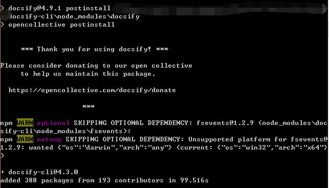

## Quick Start   *docsify*

电脑系统  Windows8.1

###### 在电脑上安装nmp（nodejs）

- [官网地址](https://nodejs.org/en/)下载nodejs
- 安装，检测是否成功`CMD，node -v 和 npm -v命令`
- 打开命令行小黑框，即可进行nmp命令操作（环境变量安装时保证已经添加）。  

###### 安装`docsify-cli` 工具

首先因为国内的问题，换掉npm的源到某宝。

```
`npm config set registry https://registry.npm.taobao.org `
```

检查换源是否OK(查看当前源地址)

```
npm config get registry 
```

安装docsify-cli工具

```
npm i docsify-cli -g
```

看到安装效果如图。  
  
安装完成！

[docsify文档地址](<https://docsify.js.org/#/zh-cn/quickstart>)  