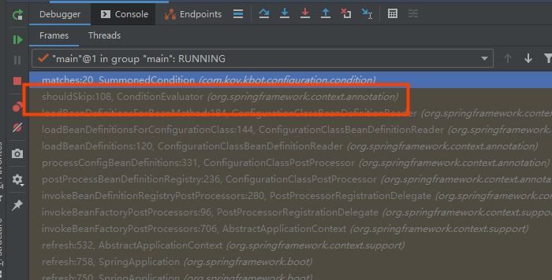

# SpringBoot 源码解读 -- Condition条件注解

说到**`SpringBoot`的自动配置**，自然就不能少了`Condition`接口下的各种`@ConditionalOnXXX`条件注解。通过自定义条件注解，可以实现对配制的可插拔化，按需加载和按需切换。

## 使用示例

比如在我的这个[K-bot](https://github.com/Koooooo-7/K-Bot)中的[`@SummonedCondition`](https://github.com/Koooooo-7/K-Bot/blob/master/src/main/java/com/koy/kbot/configuration/condition/SummonedCondition.java)注解，实现了通过对配置的`Plugin`列表的解析来决定是否加载对应的`Plugin`。

```java
@Target(ElementType.METHOD)
@Retention(RetentionPolicy.RUNTIME)
@Conditional(SummonedCondition.class)
public @interface ConditionalOnSummoned {

    String name() default "";

    String havingValue() default "";

    boolean matchIfMissing() default false;

}
```


```java
public class SummonedCondition implements Condition {
    @Override
    public boolean matches(@NotNull ConditionContext conditionContext, @NotNull AnnotatedTypeMetadata annotatedTypeMetadata) {

        // 获取注解下的所有属性字段
        Map<String, Object> attributes = annotatedTypeMetadata.getAnnotationAttributes(ConditionalOnSummoned.class.getName());

        boolean matchIfMissing = (boolean) attributes.get("matchIfMissing");
        if (matchIfMissing) {
            return true;
        }

        // get the value of name property
        String propertyName = (String) attributes.get("name");
        // get the value of havingValue property
        String value = (String) attributes.get("havingValue");

        HashSet<String> plugins = new HashSet<>();
        int i = 0;
        for (; ; ) {
            // get all values from the <propertyName> list in yaml config file
            // 获取配置文件中配置的声明的列表并遍历，注意这里是需要通过构造成对数据下标的查询。
            String plugin = conditionContext.getEnvironment().getProperty(propertyName + "[" + i++ + "]", String.class);
            if (plugin == null) {
                break;
            }
            plugins.add(plugin.toUpperCase());
        }
        return plugins.contains(value.toUpperCase());
    }
}
```


## 源码探究

我们首先就拿这个条件注解`@ConditionalOnClass（org.springframework.boot.autoconfigure.condition.ConditionalOnClass）`来看看。

```java
/**
 * {@link Conditional} that only matches when the specified classes are on the classpath.
 *
 * @author Phillip Webb
 */
@Target({ ElementType.TYPE, ElementType.METHOD })
@Retention(RetentionPolicy.RUNTIME)
@Documented
@Conditional(OnClassCondition.class)
public @interface ConditionalOnClass {

	/**
	 * The classes that must be present. Since this annotation is parsed by loading class
	 * bytecode, it is safe to specify classes here that may ultimately not be on the
	 * classpath, only if this annotation is directly on the affected component and
	 * <b>not</b> if this annotation is used as a composed, meta-annotation. In order to
	 * use this annotation as a meta-annotation, only use the {@link #name} attribute.
	 * @return the classes that must be present
	 */
	Class<?>[] value() default {};

	/**
	 * The classes names that must be present.
	 * @return the class names that must be present.
	 */
	String[] name() default {};

}
```

可以看到`@Conditional(OnClassCondition.class)`注解十分惹人注目，与之相同，可以看到比如`@ConditionalOnBean`注解上是`@Conditional(OnBeanCondition.class)`，所以这两个注解在配置上应该是等价的。我们进一步可以发现其都是继承了实现了`Condition`接口的抽象类（如`SpringBootCondition`）并自己实现了`matches`方法，最终是实现了`Condition`接口。


我们可以看一下**`Confition`**接口的定义，其作为一个函数式接口，只有一个`matched方法`，参数分别是`ConditionContext`和`AnnotatedTypeMetadata`。

```java
@FunctionalInterface
public interface Condition {

	/**
	 * Determine if the condition matches.
	 * @param context the condition context
	 * @param metadata the metadata of the {@link org.springframework.core.type.AnnotationMetadata class}
	 * or {@link org.springframework.core.type.MethodMetadata method} being checked
	 * @return {@code true} if the condition matches and the component can be registered,
	 * or {@code false} to veto the annotated component's registration
	 */
	boolean matches(ConditionContext context, AnnotatedTypeMetadata metadata);

}
```

- `ConditionContext`，顾名思义，就是需要校验/检测情形的上下文。白话而言就是在进行相关的校验时所必要的传递进来的一些信息。如bean工厂，注册的`bean`信息和环境信息等，很容易想到这都是提供给比如`ConditionalOnBean`，`OnResourceCondition`所需要的信息。

```java
/**
 * Context information for use by {@link Condition} implementations.
 *
 * @author Phillip Webb
 * @author Juergen Hoeller
 * @since 4.0
 */
public interface ConditionContext {

	/**
	 * Return the {@link BeanDefinitionRegistry} 
	 */
	BeanDefinitionRegistry getRegistry();

	/**
	 * Return the {@link ConfigurableListableBeanFactory}
	 */
	@Nullable
	ConfigurableListableBeanFactory getBeanFactory();

	/**
	 * Return the {@link Environment} for which the current application is running.
	 */
	Environment getEnvironment();

	/**
	 * Return the {@link ResourceLoader} currently being used.
	 */
	ResourceLoader getResourceLoader();

	/**
	 * Return the {@link ClassLoader} that should be used to load additional classes
	 */
	@Nullable
	ClassLoader getClassLoader();

}
```

- `AnnotatedTypeMetadata` 注解的信息，也就是可以去获取特定注解中的属性值。

所以，`matches`方法就是来通过`ConditionContext`获取所需的上下文信息，通过`AnnotatedTypeMetadata`获取对应注解的信息，然后判断是否符合加载条件。


## 跳过Bean加载

很显然知道了`matches`方法返回的是`boolean`，即表示是否满足加载条件。

那是怎么样来不加载这个方法的呢，我们在上面的自己写的那个注解打个断点，看是哪里调用了。




我们到这里一探究竟。`org.springframework.context.annotation.ConditionEvaluator#shouldSkip(org.springframework.core.type.AnnotatedTypeMetadata, org.springframework.context.annotation.ConfigurationCondition.ConfigurationPhase)`

```java
/**
	 * Determine if an item should be skipped based on {@code @Conditional} annotations.
	 * @param metadata the meta data
	 * @param phase the phase of the call
	 * @return if the item should be skipped
	 */
	public boolean shouldSkip(@Nullable AnnotatedTypeMetadata metadata, @Nullable ConfigurationPhase phase) {
        // 如果没有注解或者没有条件注解，则不会跳过
		if (metadata == null || !metadata.isAnnotated(Conditional.class.getName())) {
			return false;
		}

        // phase判断是什么阶段，是解析阶段则跳过，如果是注册阶段则不跳过
		if (phase == null) {
			if (metadata instanceof AnnotationMetadata &&
					ConfigurationClassUtils.isConfigurationCandidate((AnnotationMetadata) metadata)) {
				return shouldSkip(metadata, ConfigurationPhase.PARSE_CONFIGURATION);
			}
			return shouldSkip(metadata, ConfigurationPhase.REGISTER_BEAN);
		}

        // 获取所有标注了的@Condition相关条件注解的实现类，比如@Conditional(OnBeanCondition.class)则获得OnBeanCondition.class，并进行实例化。
		List<Condition> conditions = new ArrayList<>();
		for (String[] conditionClasses : getConditionClasses(metadata)) {
			for (String conditionClass : conditionClasses) {
				Condition condition = getCondition(conditionClass, this.context.getClassLoader());
				conditions.add(condition);
			}
		}

        // 按照@Confition优先级进行排序（@Order 和 @Priority注解的标注比较规则）
		AnnotationAwareOrderComparator.sort(conditions);

		for (Condition condition : conditions) {
			ConfigurationPhase requiredPhase = null;
			if (condition instanceof ConfigurationCondition) {
				requiredPhase = ((ConfigurationCondition) condition).getConfigurationPhase();
			}
            // 解析校验相关的条件注解调用`matches`方法，判断是否要跳过加载这个bean
			if ((requiredPhase == null || requiredPhase == phase) && !condition.matches(this.context, metadata)) {
				return true;
			}
		}

		return false;
	}
```


## 总结

> 一个基础的流程，便于记忆。


参考[SpringBoot自动配置的条件注解原理揭秘](https://github.com/yuanmabiji/Java-SourceCode-Blogs/blob/master/SpringBoot/3%20%E5%8A%A9%E5%8A%9BSpringBoot%E8%87%AA%E5%8A%A8%E9%85%8D%E7%BD%AE%E7%9A%84%E6%9D%A1%E4%BB%B6%E6%B3%A8%E8%A7%A3%E5%8E%9F%E7%90%86%E6%8F%AD%E7%A7%98%20%20SpringBoot%E6%BA%90%E7%A0%81%EF%BC%88%E4%B8%89%EF%BC%89.md)