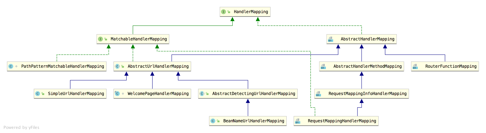

# Spring Web Dive Into
> `SpringWeb` 是使用最多的场景，在spring生态中，从SS, 到SSH, 到MVC再到现在。
对于其中类似于`一次请求从页面发起到响应，经历了什么`的网络通信问题，不在这里讨论。
主要我们看的是SpringWeb下各种不通组建的变化和线程模型相关内容。

## Servlet

`Servlet` 是一个技术，也是一个规范。这个技术/规范规定了如何同Java代码以及处理这个Java代码和请求之间的交互规则。
比如说`Tomcat`, 就是一个实现了`Servlet`规范的容器（注意不同版本对于不同规范的实现有所不同）, 我们通过冗长的xml或者`@WebServlet`定义对应处理规则, 然后将其打包成`war`包交给`Tomcat`处理。

## Spring MVC
SpringWeb本身是也是堆`Servlet`规范的实现和包装，在此之上，`SpringBoot`又做了近一步的简化和封装。
比如我们常见的`@RestController` 还有新的`Exchange`模式等, 都是在做`HandlerMapping`的事情.


主要完成的就是在`DispatchServlet`上注册好url-pattern和对应handler的映射，具体可以看[Guide to Spring Handler Mappings](https://www.baeldung.com/spring-handler-mappings).  
比如`SimpleUrlHandlerMapping`, 这个是最灵活也是和其他框架（Gin/Flask...）的路由规则最相似的定义，即定义好对应的url-pattern和对应处理的`Controller`即可。
```java
@Configuration
public class SimpleUrlHandlerMappingConfig {

    @Bean
    public SimpleUrlHandlerMapping simpleUrlHandlerMapping(WelcomeController welcome) {
        SimpleUrlHandlerMapping simpleUrlHandlerMapping = new SimpleUrlHandlerMapping();
        Map<String, Object> urlMap = new HashMap<>();
        urlMap.put("/welcome", welcome);
        simpleUrlHandlerMapping.setUrlMap(urlMap);
        
        return simpleUrlHandlerMapping;
    }

    @Bean
    public WelcomeController welcome() {
        return new WelcomeController();
    }
}

@Controller
public class WelcomeController extends AbstractController {

    @Override
    protected ModelAndView handleRequestInternal(HttpServletRequest request, HttpServletResponse response) throws Exception { 
        // ... to whatever with the Servlet request/response such as a HttpServlet instance.
     }
}
```
我们最经常使用的`一个线程捅到底`的Web模式下，这是最经常用到的方式。

## SpringWebFlux
时代在发展，BlockIO对服务的性能造成了非常大的影响。这对服务的吞吐来说，是一个巨大的灾难。所以`Callback`的方式给了一个机会`让线程不要死等，先去做其他的事情`。
我们知道的`CompletableFuture`, 再到比如`RxJava`,`Vert.x`.
但是我们也不想发生`JS`以前那种地狱，于是`Reactive`应运而生。
准确的说，我们这里要说的是[reactor](https://github.com/reactor)，和`reactor-netty`。

借助于`NIO`的操作，我们可以实现`IO`的非阻塞操作，即对于文件系统，网络，数据库等各种IO操作，都可以通过非阻塞的方式去访问，而不是一直傻等，同时也需要对应的文件系统，数据库支持。
包括返回的数据流，也可以流式返回，而不是一个完整的数据包。

这个的实现，简而言之就是在对`IO`操作的时候，给单独的线程池去做，而不是当前请求的线程block在这里。通过注册一个callback来实现回调，拿到结果进行下一步处理。整个过程都是非阻塞式的，通常除了返回给client的最后，需要真的`subscribe`整个流等待结果之外。
> 如果你要`block()`调用也没人可以阻拦你, 但是在处理请求的`reactorThread`中，你可能不会如愿。:)

此外，在`reactive`的模式下，所有的操作都是基于`数据流`，即：  
你拿到了什么->要转换成什么-> ... ->要再转换成什么->最终的结果是什么。

选择合适的值，`Mono` or `Flux` or Both.

## Refer

[Spring Web MVC Visualized: Threading and Servelts](https://www.stefankreidel.io/blog/spring-webmvc-servlet-threading)
[spring-webflux](https://www.stefankreidel.io/blog/spring-webflux)

[美团技术团队-Java NIO浅析](https://tech.meituan.com/2016/11/04/nio.html)