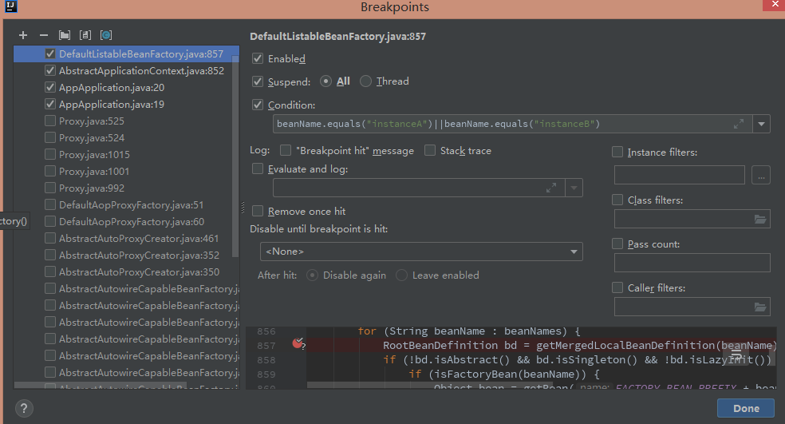
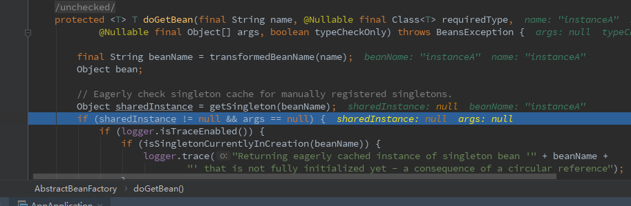
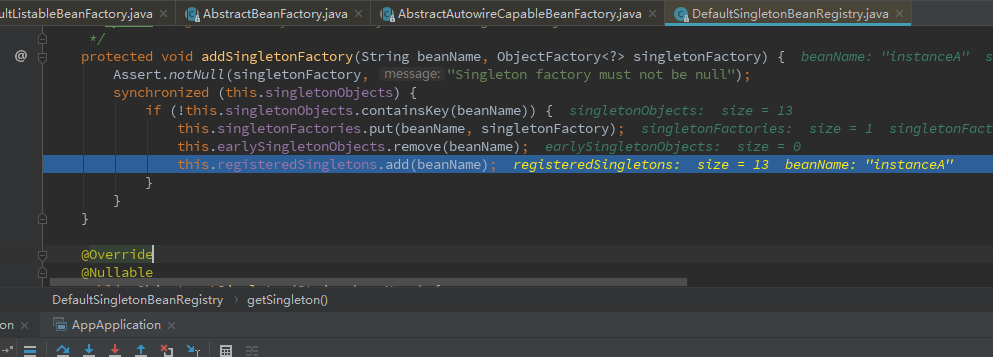
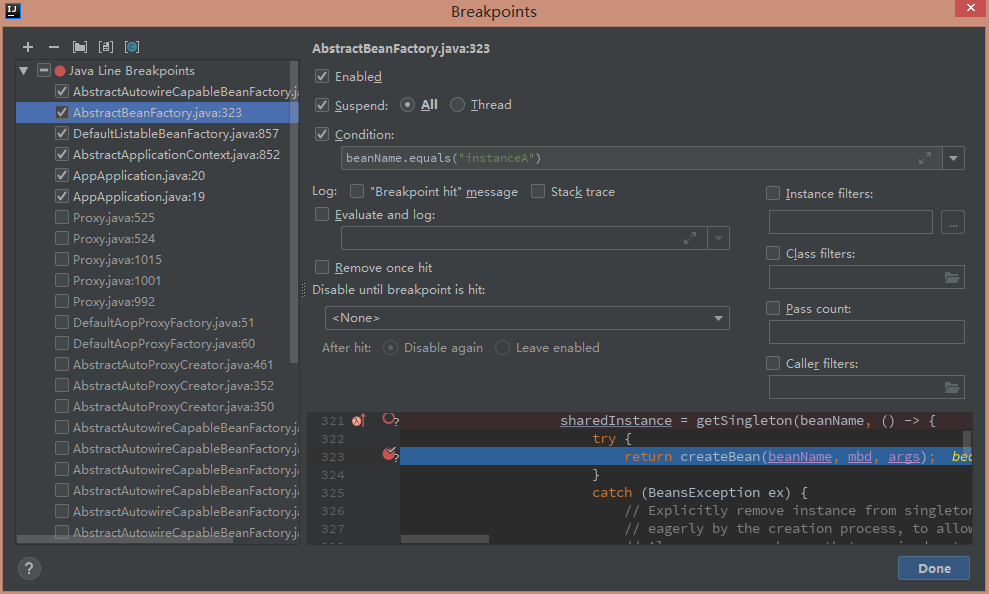
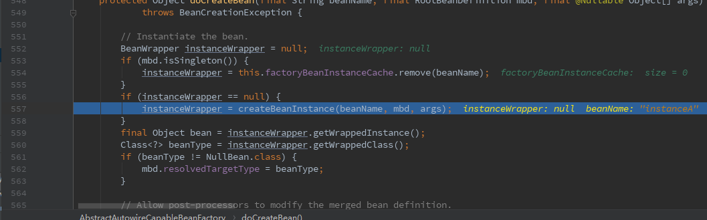

# Spring源码IOC解决循环依赖

> 撸了这么久的源码，发现要是跟看的书和视频一样写下来长篇大论。
>
> 但是好记性不如烂笔头阿，倒不如精简一点梳理:dog:。

## 长话短说

有一个实例`instanceA`（简称`A`），一个实例`instanceB`（简称`B`），双方互有引用（属性）。

- 初始化`IOC容器`，开始创建`A`，在创建`A`的时候，会通过`createBeanInstance()`对`A`调用无参构造器简单初始化（属性值都未`set`）后就会通过（`addSingletonFactory`）**提前暴露早期对象**到三级缓存中。

- 开始设置bean属性（`populateBean()`中的`applyPropertyValues()`），在解决循环依赖的时候发现引用了`B`，这时候会解决引用问题去获取`B`，发现`B`不存在，就开始和之前`A`一样创建`B`。
- 创建`B`的时候发现有对`A`的引用，就去获取`A`，显然这时候从提前暴露的缓存中拿到了`A`，接着继续`B`的创建，`B`整个创建已经完全完成，加入到单例缓存池中。
- 解决了`B`的引用问题，就继续创建`A`，完成对A的创建，加入单例缓存池。

---

**当依赖是通过构造器注入时解决依赖问题会异常的原因**：

在创建A时发现构造器有引用B，此时就开始去进行创建B时，而A还没有提前暴露被放到缓存中。又再次创建A，发生异常。

**多例情况下的循环依赖为什么不能解决**:

压根都没有Bean被放到缓存池中，所以在解决循环引用时都会去再次创建造成异常。

---

详细一点的，显然，还是要慢慢从bean的加载看起。

---

## 创建IOC容器

```java
package com.example.aop;

import com.example.aop.service.InstanceA;
import com.example.aop.service.UserService;
import com.example.aop.service.UserServiceImpl;
import org.springframework.context.annotation.AnnotationConfigApplicationContext;
import org.springframework.context.annotation.ComponentScan;
import org.springframework.context.annotation.EnableAspectJAutoProxy;

/**
 * @Description
 * @Auther Koy  https://github.com/Koooooo-7
 * @Date 2019/11/13
 */
@ComponentScan("com.example.aop.configuration")
public class AppApplication {
    public static void main(String[] args) {

        // 创建IOC容器
        AnnotationConfigApplicationContext annotationConfigApplicationContext = new AnnotationConfigApplicationContext(AppApplication.class);
        // 从单例bean缓存池中拿
        InstanceA instanceA = annotationConfigApplicationContext.getBean(InstanceA.class);

    }
}

```

在创建初始化IOC容器的时候，就会去解决初始化`bean`的问题。

在`org\springframework\context\support\AbstractApplicationContext.java`中看到下面的代码(G878)。

```java
// Instantiate all remaining (non-lazy-init) singletons.
		beanFactory.preInstantiateSingletons();
```

---


**下面快速进入现场**。

在org\springframework\beans\factory\support\DefaultListableBeanFactory.java（G857）打个条件断点。





**来到了获取InstanceA这个bean的现场**。




来到`org/springframework/beans/factory/support/AbstractBeanFactory.java`的`doGetBean()`方法。

> 以do*开头的是实际执行逻辑的方法。

然后注意到这一行获取单例的`bean`(`G249`)，在容器中默认都是单例的`bean`。

```java
		// Eagerly check singleton cache for manually registered singletons.
		Object sharedInstance = getSingleton(beanName);
```

接着进去。

`org\springframework\beans\factory\support\DefaultSingletonBeanRegistry.java`中(G177)。

```java
/**
	 * Return the (raw) singleton object registered under the given name.
	 * <p>Checks already instantiated singletons and also allows for an early
	 * reference to a currently created singleton (resolving a circular reference).
	 * @param beanName the name of the bean to look for
	 * @param allowEarlyReference whether early references should be created or not
	 * @return the registered singleton object, or {@code null} if none found
	 */
	@Nullable
	protected Object getSingleton(String beanName, boolean allowEarlyReference) {
        // Bean是否在this.singleObjects中，即单例缓存池中。
		Object singletonObject = this.singletonObjects.get(beanName);
        // 如果没有，再看该bean是否是正在创建中。
		if (singletonObject == null && isSingletonCurrentlyInCreation(beanName)) {
			synchronized (this.singletonObjects) {
                // 如果还是没有，就继续往下找。
				singletonObject = this.earlySingletonObjects.get(beanName);
				if (singletonObject == null && allowEarlyReference) {
					ObjectFactory<?> singletonFactory = this.singletonFactories.get(beanName);
					if (singletonFactory != null) {
						singletonObject = singletonFactory.getObject();
						this.earlySingletonObjects.put(beanName, singletonObject);
						this.singletonFactories.remove(beanName);
					}
				}
			}
		}
		return singletonObject;
	}
```

**继续**。

`org\springframework\beans\factory\support\AbstractAutowireCapableBeanFactory.java`(G579)。

```java
	// Eagerly cache singletons to be able to resolve circular references
		// even when triggered by lifecycle interfaces like BeanFactoryAware.
		boolean earlySingletonExposure = (mbd.isSingleton() && this.allowCircularReferences &&
				isSingletonCurrentlyInCreation(beanName));
		if (earlySingletonExposure) {
			if (logger.isTraceEnabled()) {
				logger.trace("Eagerly caching bean '" + beanName +
						"' to allow for resolving potential circular references");
			}
            // 暴露早期对象
			addSingletonFactory(beanName, () -> getEarlyBeanReference(beanName, mbd, bean));
		}
```




`org\springframework\beans\factory\support\AbstractBeanFactory.java`（G323）加上条件断点。




**跟进去，到具体创建bean实例的地方**

`\org\springframework\beans\factory\support\AbstractAutowireCapableBeanFactory.java`





`org\springframework\beans\factory\support\DefaultSingletonBeanRegistry.java` (G133)

创建完毕，移除缓存，把创建的bean添加到单例池。

```java
	
/**
	 * Add the given singleton object to the singleton cache of this factory.
	 * <p>To be called for eager registration of singletons.
	 * @param beanName the name of the bean
	 * @param singletonObject the singleton object
	 */
	protected void addSingleton(String beanName, Object singletonObject) {
		synchronized (this.singletonObjects) {
			this.singletonObjects.put(beanName, singletonObject);
			this.singletonFactories.remove(beanName);
			this.earlySingletonObjects.remove(beanName);
			this.registeredSingletons.add(beanName);
		}
	}
```

继续到`populateBean(beanName, mbd, instanceWrapper)`方法中的

`applyPropertyValues(beanName, mbd, bw, pvs)`去解决循环引用，开始实例化B重复上面的步骤，

当发现B引用A的时候就直接从缓存中取得了提前暴露的A，接着完成了B的初始化。

之后继续完成A的初始化。

---

## 参考

[**文章：Spring IOC 容器源码分析 - 循环依赖的解决办法**](https://www.imooc.com/article/34150)

[**视频：Spring源码深度解析**](https://www.bilibili.com/video/av59860410)