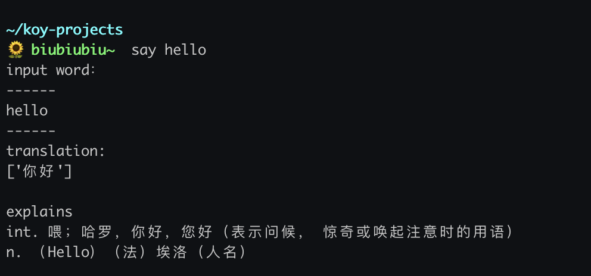

# 命令行翻译脚本

> 找了一些都有点麻烦，索性自己写了一个:dog:。


使用的有道的API，接口的`token`在Github上找到的。

需要安装`requests` 模块。

- `translator.py`

```python
#!/usr/bin/python
# -*- coding: utf-8 -*-
import requests
import sys

URL = "http://fanyi.youdao.com/openapi.do?keyfrom=mlovez-dev&key=1341364669&type=data&doctype=json&version=1.1&q="


def translate(word):
    if not word:
        print("empty")
        return
    re = requests.request(method="get", url=URL + word)
    if re.status_code != 200:
        print("接口返回状态码错误...")
        return

    if not re or not re.json():
        print("接口返回状态码错误...")
        return
    data = re.json()
    if data["errorCode"] != 0:
        print("接口返回状态码错误...")
        return
    print("input word：")
    print("------")
    print(word)
    print("------")
    print("translation:")
    print(data["translation"])
    if "basic" in data.keys():
        explains = data["basic"]["explains"]
        if "explains" in data["basic"].keys():
            print("\nexplains")
            for explain in explains:
                print(explain)
 

if __name__ == "__main__":
    translate("".join(sys.argv[1:]))

```


- `./zshrc`

  `alias say="cd /usr/local/Cellar/python@3.9/3.9.2_1/bin/  &&  python3 ~/translator.py"`

  这里没有把系统python版本改为`py3`，所以直接到安装目录来call。

  `source ~/.zshrc`


- 示例

  

